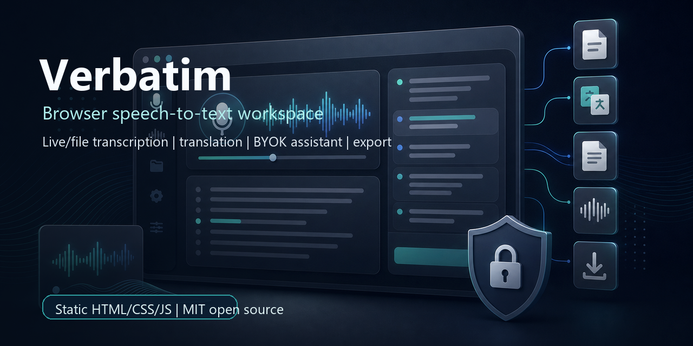
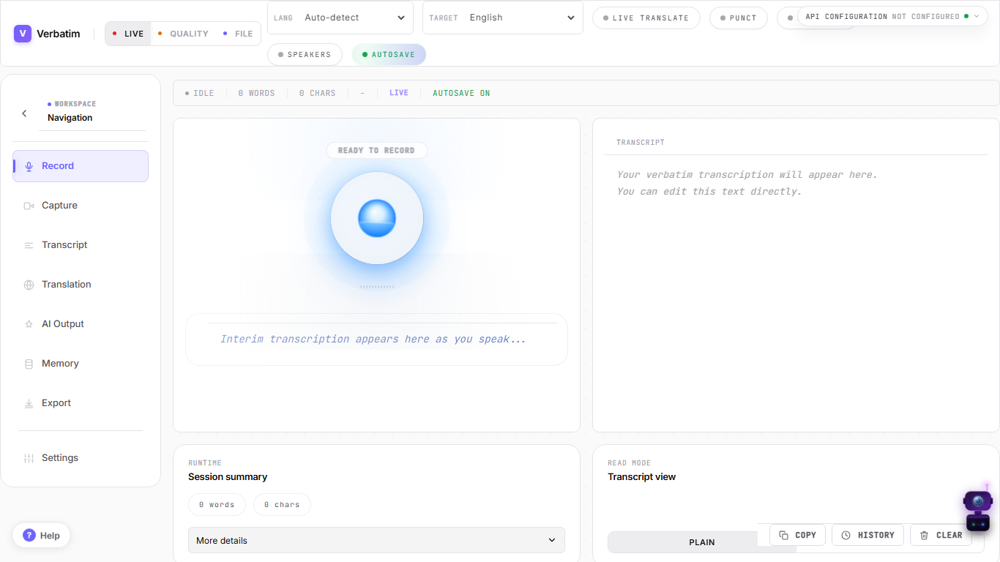
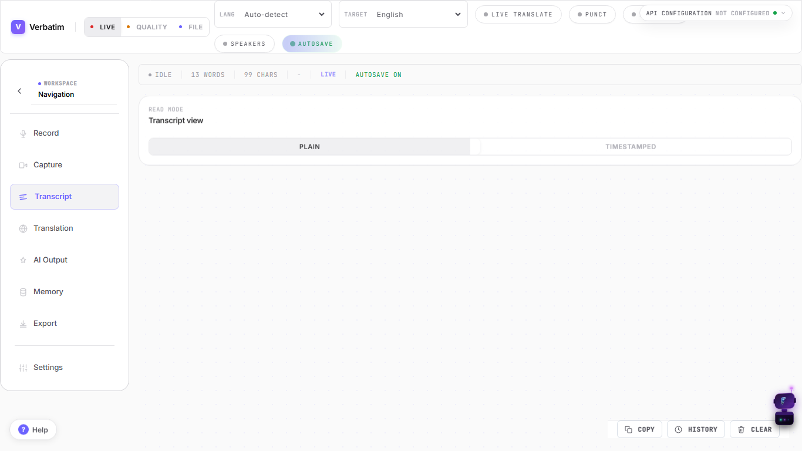
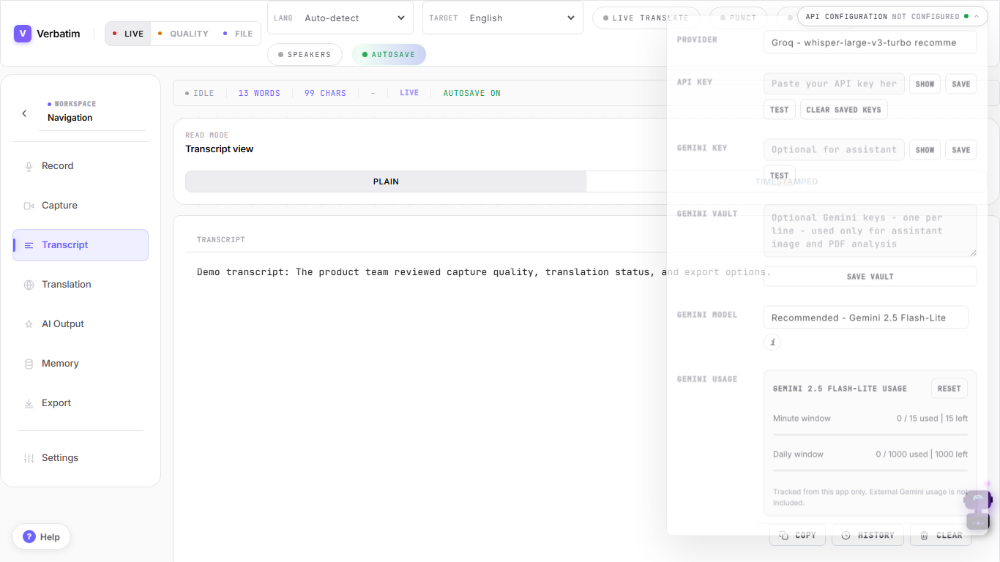
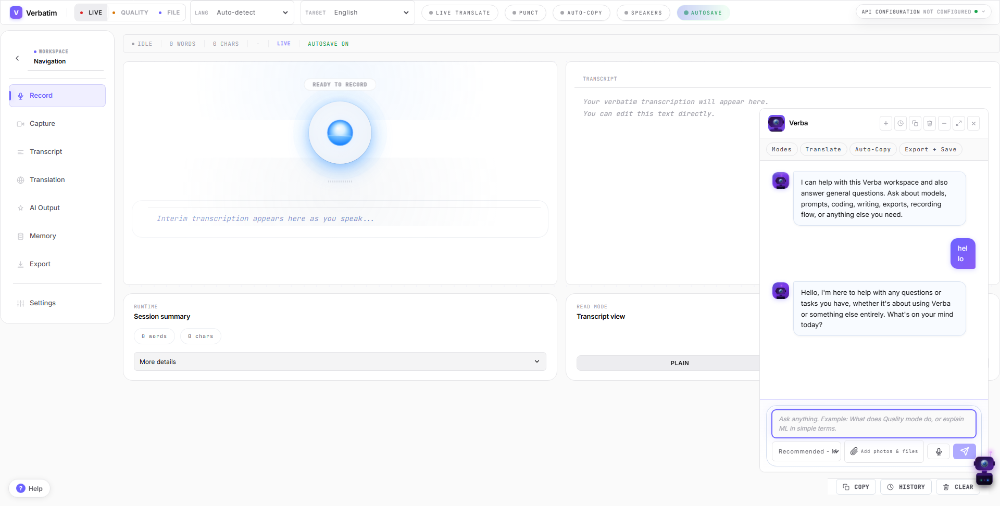
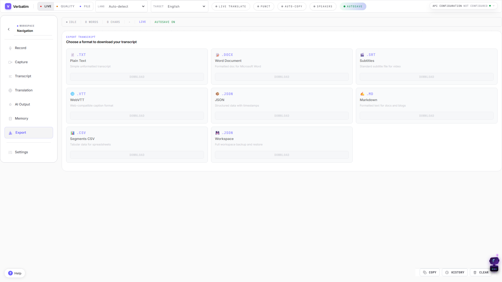
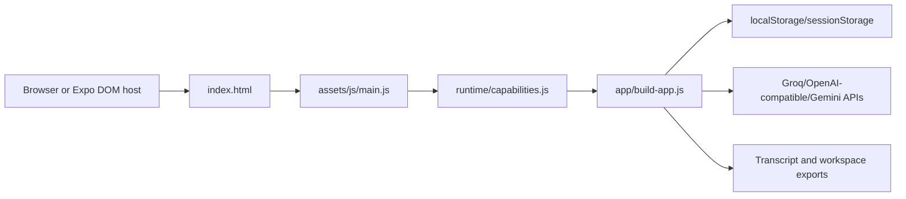

# Verbatim

[](https://github.com/RossDmello2/verbatim-browser-transcriber/actions/workflows/ci.yml)
[](LICENSE)
[](index.html)

**Static browser speech-to-text workspace for live/file transcription, translation, bring-your-own-key assistant workflows, and transcript export.**

Verbatim is an open-source browser transcription workspace for voice-to-text capture, audio/video file transcription, translation, assistant workflows, diagnostics, and subtitle-ready exports. It is built as a static HTML/CSS/JavaScript app, so it can run from static hosting without a custom backend.

It is for students, developers, researchers, and maintainers who want an inspectable transcript workspace that keeps setup simple. Provider-backed features use bring-your-own-key (BYOK) Groq/OpenAI-compatible or Gemini credentials entered in the app UI.

## Preview



The banner above is conceptual artwork with deterministic text overlay, not a screenshot. The screenshots below were captured from the real local app with default/demo data.

Live package preview: [GitHub Pages demo](https://rossdmello2.github.io/verbatim-browser-transcriber/production%20ready/). Provider-backed calls still require user-owned API keys.

| Recording workspace | Transcript workflow | API configuration |
|---|---|---|
|  |  |  |

| Assistant workflow | Export tools |
|---|---|
|  |  |

More verified desktop, tablet, and phone screenshots are listed in [docs/mobile-ui/SCREENSHOT_MANIFEST.md](docs/mobile-ui/SCREENSHOT_MANIFEST.md).

## Current Status

**READY WITH GAPS**

Passed locally on June 1, 2026:

- `npm ci`
- `npm --prefix apps/mobile ci`
- `npm test`
- `npm run test:web:smoke`
- `npm --prefix apps/mobile run check`
- `npm audit --audit-level=moderate`

Known gaps:

- `npm --prefix apps/mobile audit --audit-level=moderate` reports 13 moderate transitive advisories through the Expo dependency chain. `npm audit fix --force` proposes a breaking Expo upgrade, so it was not applied in this documentation/publishing pass.
- Live provider success calls require owner/user API keys and were not run.
- Real microphone, tab audio, screen capture permissions, and physical Expo Go/device behavior require local browser/device interaction and are not claimed as fully verified here.
- The GitHub Pages preview is verified at the nested package path, but there is no custom production domain.

## What It Does

- Runs as a static browser app from `index.html` with no backend server requirement.
- Checks browser support for speech recognition, microphone recording, display capture, audio context, and secure-context behavior before booting the workspace.
- Supports live speech recognition, quality microphone recording, browser-supported tab/screen audio capture, and audio/video file transcription.
- Routes transcription and chat requests directly to Groq/OpenAI-compatible APIs and Gemini from the browser after the user configures keys.
- Stores workspace state, transcript segments, memory packs, provider choices, and optional key vaults in browser storage.
- Validates imported workspace JSON before restore.
- Exports transcripts and workspace data in TXT, DOCX, SRT, VTT, JSON, Markdown, CSV, and workspace backup formats.
- Includes an optional Expo Router mobile shell that loads the existing web runtime through `apps/mobile/components/verbatim-dom.tsx`.

## What Works Without API Keys

| Workflow | Works without keys? | Notes |
|---|---:|---|
| App boot and navigation | Yes | Static app loads from a local server or static host. |
| Browser-native live speech recognition | Browser-dependent | Requires browser support and user permission. |
| Transcript editing | Yes | Plain transcript editing is local. |
| Workspace import/export | Yes | Workspace JSON stays local to the browser. |
| TXT/Markdown/CSV/JSON/DOCX/SRT/VTT export | Yes | Exported files may contain private transcript data. |
| Groq/OpenAI audio transcription | No | Requires a user-owned provider key. |
| Gemini assistant file/image/PDF analysis | No | Requires a user-owned Gemini key. |
| Provider key testing | No | Calls the configured provider. |

## Tech Stack

| Layer | Technology | Evidence |
|---|---|---|
| Static runtime | HTML, CSS, browser ES modules | `index.html`, `assets/css/**`, `assets/js/**` |
| Main app logic | Plain JavaScript | `assets/js/app/build-app.js` |
| Capability gate | Browser API checks | `assets/js/runtime/capabilities.js` |
| Storage | `localStorage` and `sessionStorage` | `assets/js/app/state.js` |
| Provider calls | Fetch to Groq/OpenAI-compatible/Gemini APIs | `assets/js/app/build-app.js` endpoint builders |
| Tests | Node test runner and Playwright | `tests/unit/**`, `tests/web/verbatim.spec.js` |
| Mobile shell | Expo Router and React Native Web dependencies | `apps/mobile/**` |
| Static hosting | Netlify config | `netlify.toml` |

## Architecture

Verbatim is client-only. The static shell in `index.html` loads `assets/js/main.js`; that module checks runtime capabilities from `assets/js/runtime/capabilities.js` and then calls `buildApp()` in `assets/js/app/build-app.js`.



There is no backend, server route layer, webhook receiver, database, or server-side auth system in this package. Full architecture notes are in [docs/architecture/overview.md](docs/architecture/overview.md), and the documentation map starts at [docs/README.md](docs/README.md).

## Project Structure

```text
production ready/
|-- index.html              Static app entrypoint
|-- assets/                 CSS and browser ES modules
|-- apps/mobile/            Thin Expo Router mobile shell
|-- docs/                   Architecture, API, security, and operations docs
|-- tests/                  Node unit tests and Playwright smoke tests
|-- scripts/                Static verification scripts
`-- .github/                Package-level CI, Dependabot, and contribution templates
```

Repository-root note: this package is nested under `production ready/` in the existing `RossDmello2/verbatim-browser-transcriber` repository. Root-level README/community/CI files are included in the repository so GitHub can present and verify the project while preserving the original repository history.

## Quick Start

Prerequisites:

- Node.js 22 or newer for verification scripts.
- A modern browser. Chrome or Edge is recommended for the broadest speech/capture support.
- Python 3, Node.js, or any static file server for local hosting.
- Provider API keys only if you want Groq, OpenAI-compatible, or Gemini-backed features.

```powershell
git clone https://github.com/RossDmello2/verbatim-browser-transcriber.git
cd verbatim-browser-transcriber
cd "production ready"
npm ci
python -m http.server 8080
```

Open `http://localhost:8080`.

If port `8080` is already in use:

```powershell
python -m http.server 8090
```

Then open `http://localhost:8090`.

Do not open `index.html` directly from disk for normal use. Serving the folder keeps browser module loading and secure-context APIs consistent.

## Configuration

Verbatim does not read server-side environment variables. Provider keys are entered in the app UI and stored in browser storage only when saved by the user.

| Setting | Required | Default | Description |
|---|---:|---|---|
| Provider | No | `groq` | Selected in the API Configuration panel. |
| Groq/OpenAI API key | For Groq/OpenAI transcription, chat, and cleanup | Empty | Stored locally only if saved by the user. |
| Gemini API key | For Gemini image/PDF/text attachment analysis | Empty | Stored locally only if saved by the user. |
| Audio model | No | Provider-specific default | Defaults are defined in `assets/js/app/build-app.js`. |
| Chat model | No | Provider-specific default | Defaults are defined in `assets/js/app/build-app.js`. |
| Translation target | No | `en` | Stored in browser storage. |
| Memory packs/glossary | No | Built-in starter glossary | Stored in browser storage. |

Copy `.env.example` only as a documentation reference. It intentionally contains no real secrets.

## Common Workflows

```powershell
npm test
```

Runs static checks plus Node unit tests for workspace import validation and provider timeout behavior.

```powershell
npm run test:web:smoke
```

Starts a local static server through Playwright and checks app boot, navigation, workspace import rejection/success, provider timeout UI, responsive layout, mobile drawers, assistant controls, and touch targets.

```powershell
npm --prefix apps/mobile run check
```

Runs the Expo shell TypeScript check.

```powershell
npm --prefix apps/mobile run start
```

Starts the optional Expo shell. Device-level Expo Go verification requires a physical device or simulator outside the static browser test path.

## API Reference

Verbatim does not expose HTTP routes. It calls third-party provider APIs directly from the browser when the user configures keys.

| Provider | Runtime Use | Endpoint Family | Auth |
|---|---|---|---|
| Groq | Audio transcription/translation and chat completions | `https://api.groq.com/openai/v1/...` | Bearer API key |
| OpenAI | Audio transcription/translation and chat completions fallback | `https://api.openai.com/v1/...` | Bearer API key |
| Gemini | Assistant image/PDF/text analysis and key testing | `https://generativelanguage.googleapis.com/...` | `x-goog-api-key` |

See [docs/api/provider-integrations.md](docs/api/provider-integrations.md) for the detailed integration inventory.

## Database

There is no database, schema, migration folder, seed data, or server persistence layer. Browser storage is the data layer:

- `localStorage` stores workspace/provider/model/cache values.
- `sessionStorage` stores short-lived diagnostics, history, drafts, and output state.
- Exported workspace JSON is user-controlled data and may contain sensitive transcript content.

See [docs/architecture/data-layer.md](docs/architecture/data-layer.md).

## Deployment

Verbatim deploys as static files. Netlify is configured through `netlify.toml` when `production ready/` is used as the site base directory.

Deployment rules:

- Serve over HTTPS or `localhost`; browser capture APIs are limited in insecure contexts.
- Use `production ready/` as the app root unless the repository is deliberately flattened.
- Do not inject provider secrets into build or hosting settings. Users enter their own keys in the app UI.
- Keep security headers enabled. The current Netlify config sets `X-Content-Type-Options`, `X-Frame-Options`, and `Referrer-Policy`.

See [docs/deployment.md](docs/deployment.md).

## Security

- Provider keys are stored in browser or WebView `localStorage` only when saved in the UI.
- Use **Clear saved keys** in API Configuration before sharing a browser profile or device.
- Do not share browser profiles or exported workspace data containing sensitive transcripts or keys.
- The app makes direct HTTPS requests from the browser to configured providers.
- Workspace import accepts user-selected JSON and validates version, size, unsafe keys, and high-risk collection sizes before restore.

See [SECURITY.md](SECURITY.md), [PRIVACY.md](PRIVACY.md), and [docs/security/security-quality.md](docs/security/security-quality.md).

## Troubleshooting

See [TROUBLESHOOTING.md](TROUBLESHOOTING.md) for port conflicts, blank page checks, browser permissions, API-key setup, mobile shell limits, and dependency audit notes.

## Naming

The canonical product name is **Verbatim**. **Verba Assistant** is the in-app assistant name. The GitHub repository slug is `RossDmello2/verbatim-browser-transcriber`, renamed from `RossDmello2/Verba-Transcriber` after owner approval on 2026-06-01. Root and mobile npm package names are private tooling names. See [docs/intelligence/NAMING_SEO_STRATEGY.md](docs/intelligence/NAMING_SEO_STRATEGY.md) and [docs/operations/PROJECT_NAMING.md](docs/operations/PROJECT_NAMING.md).

## Contributing

See [CONTRIBUTING.md](CONTRIBUTING.md) for setup, style, and pull request guidance.

## License

This project is licensed under the MIT License. See [LICENSE](LICENSE).
